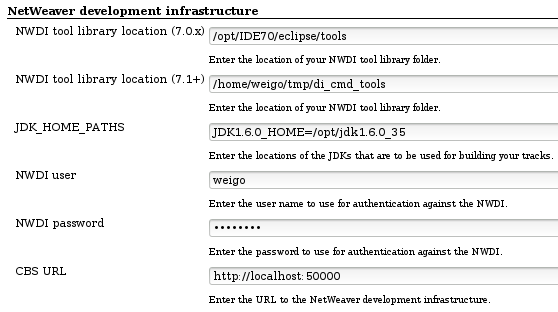
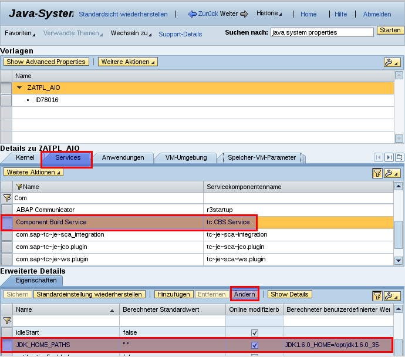
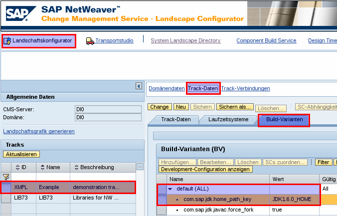
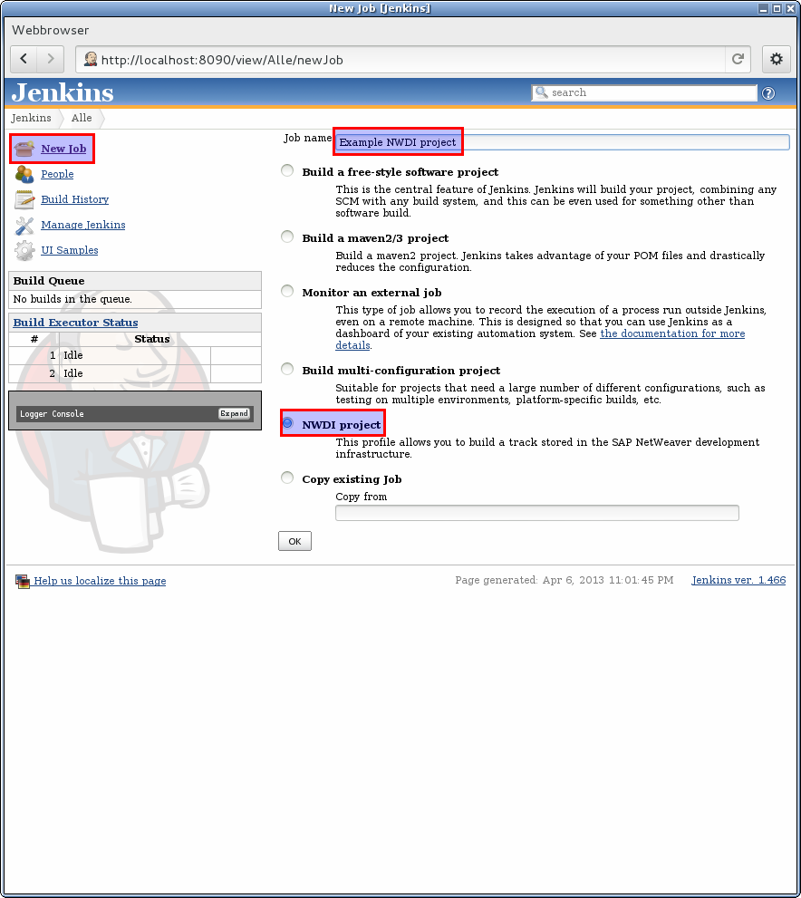
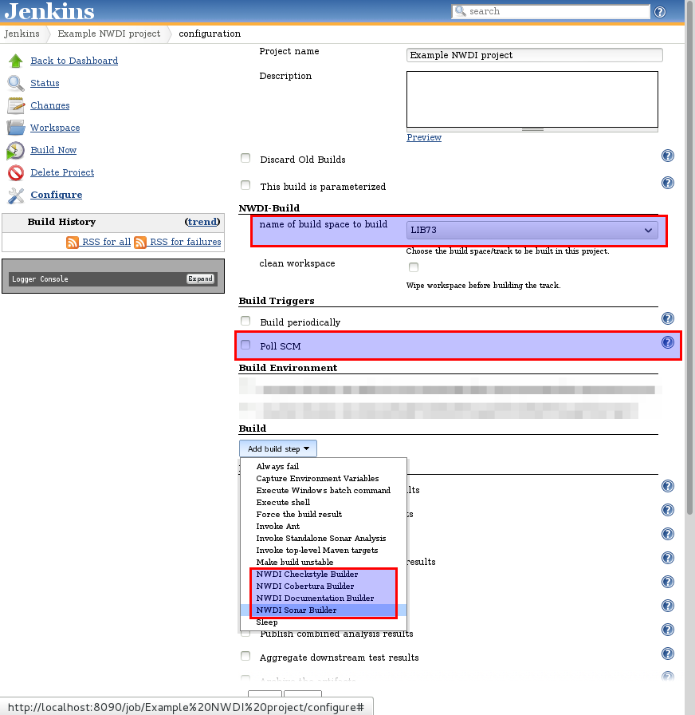

# The Jenkins NWDI-Core-Plugin guide
## Introduction

Did you ever wonder how to integrate quality assessment tools like Checkstyle, FindBugs and Sonar into the NetWeaver development infrastructure (NWDI)?This document describes how to build, install, configure and use the Jenkins NWDI-Core-Plugin. It will show you how to answer the above question using the other members of the Jenkins NWDI-Plugin family.
### What is the NWDI-Core-Plugin?

The NWDI-Core-Plugin integrates the SAP NetWeaver development infrastructure (NWDI) into the Jenkins continuous integration environment.

The plugin adds various new capabilities to Jenkins:

* A new project type that lets the user configure a CBS build space (or NWDI track) to monitor for changes to development components.
* A new source code management system (SCM) that monitors the configured track for changes to development components.
* A new type of build that synchronizes changed development components (and their dependencies) to a Jenkins workspace and builds those components.
  The plugin also exposes an object model to be used by other plugins to add functionality with respect to SAP NetWeaver development components to Jenkins.

## Build, installation and configuration of the NWDI-Core-Plugin
### Building and installing the plugin

The plugin is not available through the Jenkins update center yet. To build the plugin you'll need to clone the following GitHub repositories:

```
git clone git://github.com/weigo/NWDI-config-plugin.git
git clone git://github.com/weigo/NWDI-pom-Plugin.git
git clone git://github.com/weigo/NWDI-Core-Plugin.git
```
and build the Maven projects:

Prior to attempt to build the plugin you'll have to adjust your Maven configuration for Jenkins plugin development. For details on how to adjust your`settings.xml`read the article<a href="https://wiki.jenkins-ci.org/display/JENKINS/Plugin+tutorial#Plugintutorial-SettingUpEnvironment">Plugin tutorial - Setting Up Environment</a>. Now you're ready to build the plugin:


```
for d in NWDI-config-plugin NWDI-pom-Plugin NWDI-Core-Plugin;\
  do (cd $d; mvn install); done
```
In the directory **NWDI-Core-Plugin/target** you'll find the **NWDI-Core-Plugin.hpi** file which you should upload using the Jenkins update center extended settings view.

### NetWeaver DI command line tools installation


#### NetWeaver 7.0.x

With NetWeaver 7.0.x the DI command tools are provided together with NetWeaver developer studio. They are located in the sub folder **tools** beneath your NWDS installation folder. Copy this folder to your Jenkins server.

#### NetWeaver 7.1.+

NetWeaver versions more recent than 7.0.x do not provide the DI command tools with the NetWeaver developer studio. You'll need to download the software component archive (SCA) **DICLIENTS.SCA** from SAP market place (enter 'DICLIENTS' as search term).

Unzip the SCA. In the sub folder **DEPLOYARCHIVES** there is the SDA **tc~di~cmd_tools~sda.sda.** Extract the ZIP archive **di_cmd_tools.zip** and copy it to your Jenkins Server. Unpack the archive to a location of your choice.

#### patching dctool.(bat|sh)

The batch file/shell script needs to be adapted to use the environment variable _JDK_PROPERTY_NAME_ to build other build variants than `default`.

On Unix systems please verify the encoding/line endings of the modified shell scripts. These should not contain DOS line endings. The interpreter to execute the shell scripts won't be found otherwise.


##### NetWeaver 7.0.x

The call to the Java VM (on Windows) should look like this:


```
call "%JAVA_HOME%\bin\java" -classpath "%startup%" -Xmx256m -Xss20m
  -Ddctool.jarrootdir="%NWDITOOLLIB%"
  -Ddctool.JDK_PROPERTY_NAME="%JDK_PROPERTY_NAME%"
  %PARAM_JDK% %APPL% %*
```
On Unix the VM should be called like this:


```
"$JAVA_HOME/bin/java" -classpath "$startup" -Xmx256m -Xss20m\
  -Ddctool.jarrootdir="$NWDITOOLLIB"\
  -Ddctool.JDK_PROPERTY_NAME="$JDK_PROPERTY_NAME" $PARAM_JDK $APPL $*
```

##### NetWeaver 7.1+

The call to the Java VM (on Windows) should look like this:


```
call "%JAVA_HOME%\bin\java" -classpath "%startup%" -Xmx256m -Xss20m
  -Dappl.jars="%NWDITOOLLIB%"
  -Dappl.classname=com.sap.tc.cetool.DcConsoleApplication
  -Ddctool.JDK_PROPERTY_NAME=%JDK_PROPERTY_NAME% %PARAM_JDK% %APPL% %*
```
On a Unix system the shell script should call the Java VM like this:


```
"$JAVA_HOME/bin/java" -cp "$startup" -Xmx256m -Xss20m\
  -Dappl.jars="$NWDITOOLLIB"\
  -Dappl.classname=com.sap.tc.cetool.DcConsoleApplication\
  -Ddctool.JDK_PROPERTY_NAME="$JDK_PROPERTY_NAME" $PARAM_JDK $APPL $*
```

### Global configuration

After installation of the NWDI-Core-Plugin you'll find a new section _NetWeaver development infrastructure_ on the Jenkins global
configuration page.

*global settings for the Jenkins NWDI-Core-Plugin*


The following table describes which information should go into which field in the above figure:

<table>
<tr><td>NWDI tool library location (7.0.x)</td>
<td>Enter the path to where you installed the DI tools for NetWeaver 7.0.x,</td>
</tr>
<tr><td>NWDI tool library location (7.1.+)</td>
<td>Enter the path to where you installed the DI tools for NetWeaver CE and beyond,</td>
</tr>
<tr><td>JDK_HOME_PATHS</td>
<td>In this field enter the values as configured in the NetWeaver Administrator (NWA) for NetWeaver CE and post CE systems or using the 
Config Tool for NetWeaver 7.0.x systems. Valid keys are:

* JDK1.3.1_HOME,
* JDK1.4.2_HOME,
* JDK1.5.0_HOME,
* JDK1.6.0_HOME and
* JDK1.8.0_HOME.

Separate multiple entries with semicolon. The article <a href="http://help.sap.
com/saphelp_nw73/helpdata/en/4d/c149fa499d48318debe4249d80711c/frameset.htm">Building Using Different JDK Versions</a> describes how the
CBS determines which JDK version should be used to build a particular development component and how this can be configured.See also the next chapter for details on configuring the NWDI wrt. build paths and build variants.</td>
</tr>
<tr><td>NWDI user</td>
<td>Enter the user that should be used to connect to the NWDI.</td>
</tr>
<tr><td>NWDI password</td>
<td>Enter the password that should be used to authenticate the user against the NWDI.</td>
</tr>
<tr><td>CBS URL</td>
<td>Enter the URL to be used to connect to the NWDI (This is the same URL you would enter in the NWDS to configure access to the NWDI).</td>
</tr>
</table>

## NetWeaver administrator and CMS configuration tasks
### `JDK_HOME_PATHS` configuration using the NetWeaver administrator

Open the NetWeaver administrator in the web browser and go to the_java system properties_view (you can search for this view using the search field in the upper right corner in the NetWeaver administrator). Select the_services_tab and search for the_Component Build Service_entry.

In the_properties_tab at the bottom look for the `JDK_HOME_PATHS.` Klick on the_edit_button to add or delete a path to a JDK.

The following figure shows how to configure the `JDK_HOME_PATHS` in the NetWeaver administrator.

*JDK_HOME_PATHS configuration in NWA*


### CMS build variant configuration

To build a track or a software component using a JDK different from the one the CBS is running with, a build variant has to be configured for this track/software component.

Open the landscape configurator in the CMS and select the track you want to configure. Select the link_track data_and then the tab_build variants._Define the property`com.sap.jdk.home_path_key`and assign it the JDK home path to be used for building.

See the following figure how the configuration should look like for building components using a Java 1.6 development kit.

*build variant configuration in CMS*


## Creating and configuring a new NWDI-Project

To create a new_NWDI project_click on the `New Job` link in the side panel at the left of the Jenkins main page. Choose `NWDI project` from
the choices presented in this view. Assign a name to the Job and click the `Ok` button at the bottom of the page. See the following
figure on how the view should look like.

*create a new Jenkins NWDI project*

The view now shown presents some choices unique to the NWDI-Core-Plugin. The plugin adds a section `NWDI-Build` to the view where you can
select the build space (or track) to build.

*configure a new Jenkins NWDI project*

Check the `clean workspace` option when you'd like to rebuild the whole track regardless of the existence of new activities since the
last build. *Warning*: This is a potentially lengthy operation since all development components used by components of this track will be
synchronized from the CBS.

Do this when you imported software components from another track into the this track. Development components that depend on the imported
SCs should probably be rebuilt against the imported versions of development components.The section `Build Triggers` contains a check box
labelled `Poll SCM`. You should tick this on and configure a time plan. Enter `*/30 * * * *` to query the DTR every thirty minutes for
changes (i.e. activities checked into the development workspace by your developers).The section `Build` presents a select box you can use
to add new build steps to this build. Jenkins plugins special to the integration of the NWDI are discussed in

## Jenkins plugins based on the NWDI-Core-Plugin

<table>
<tr><td><a href="https://github.com/weigo/NWDI-Sonar-Plugin">NWDI-Sonar-Plugin</a></td>
<td>This plugin uses the Sonar Maven plugin to analyze Java sources of development components. The analysis results will be published to a Sonar installation.</td>
</tr>
</table>

The plugins integrating Checkstyle, Cobertura and PMD with the NWDI and Jenkins will not be updated to match developments in the
NWDI-Core-Plugin. You should use the NWDI-Sonar-Plugin which integrates SonarQube via the SonarScanner tool.
